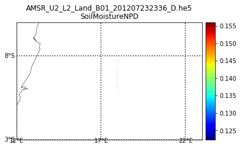

Copyright (C) 2017 The HDF Group
 
This example code illustrates how to access and visualize NSIDC
AMSR HDF-EOS5 Point product in Python via OPeNDAP.

If you have any questions, suggestions, or comments on this example, please use the HDF-EOS Forum (http://hdfeos.org/forums).

If you would like to see an example of any other NASA HDF/HDF-EOS data
product that is not listed in the HDF-EOS Comprehensive Examples page
(http://hdfeos.org/zoo), feel free to contact us at eoshelp@hdfgroup.org or post it at the HDF-EOS Forum (http://hdfeos.org/forums).


Tested under: Python 2.7.13 :: Anaconda 4.3.1 (x86_64)

Last updated: 2017-3-13


```python
import os
import matplotlib as mpl
import matplotlib.pyplot as plt
from mpl_toolkits.basemap import Basemap
import numpy as np
import csv
import urllib2
import math
```

Set OPeNDAP URL. NSIDC runs a [Hyrax server that enables CF output](http://n5eil01u.ecs.nsidc.org/opendap/hyrax/AMSA/AU_Land.001/2012.07.23/AMSR_U2_L2_Land_B01_201207232336_D.he5.html) for HDF5 data product. Such server cannot handle compound data type in HDF-EOS5 Point data product. Therefore, we copied a sample file and put it on our demo [Hyrax server that disabled CF Output](https://eosdap.hdfgroup.org:8989/opendap/hyrax/data/NASAFILES/hdf5/AMSR_U2_L2_Land_B01_201207232336_D.he5.html). 

For large subset of data, this code will not work for some reason. Thus, we select 10 points using OPeNDAP's constraint expression. 

Neither PyDAP nor netCDF4 python module can handle OPeNDAP's array of structure.Thus, we will read data in ASCII instead of DAP2.


```python
url = ("https://eosdap.hdfgroup.org:8989" # Server
    "/opendap/hyrax/data/NASAFILES/hdf5/" # Path to data on server
    "AMSR_U2_L2_Land_B01_201207232336_D.he5" # HDF-EOS5 Point file
    ".ascii?" # OPeNDAP request
    "/HDFEOS/POINTS/AMSR-2%20Level%202%20Land%20Data/Data/" # Group Path
    "Combined%20NPD%20and%20SCA%20Output%20Fields" # HDF5 Dataset
    "[3700:1:3709]") # OPeNDAP constraint - select 10 points.
response = urllib2.urlopen(url)
cr = csv.reader(response)

# The first line of output is dataset name.
i = 0
# Every 3rd row is the actual value in CSV format.
j = -1
lat = np.array([], dtype=float)
lon = np.array([], dtype=float)
data = np.array([], dtype=float)
for row in cr:
    if i != 0:
        j = j+1
    if i != 0 and (j % 3 == 2):
        # Latitude        
        # print row[1]
        lat = np.append(lat, float(row[1]))
        # Longitude        
        # print row[2] 
        lon = np.append(lon, float(row[2]))
        # SoilMoistureNPD        
        # print row[16]
        data = np.append(data, float(row[16]))
    i = i+1
print lat, lon, data
```

    [-5.95511 -6.1588  -6.35505 -6.56324 -6.75285 -6.96071 -7.14491 -7.34555
     -7.53102 -7.7309 ] [ 17.9583  17.9724  17.9519  17.9644  17.9538  17.9567  17.9625  17.952
      17.9661  17.9547] [ 0.13084   0.122343  0.130008  0.140189  0.148062  0.155974  0.153412
      0.144981  0.147109  0.150234]


Let's plot the data using the above lat/lon/data ASCII values retrieved from OPeNDAP server.


```python
m = Basemap(projection='cyl', resolution='l',
             llcrnrlat=-90, urcrnrlat=90,
             llcrnrlon=-180, urcrnrlon=180)
m.drawcoastlines(linewidth=0.5)
m.scatter(lon, lat, c=data, s=1, cmap=plt.cm.jet, edgecolors=None, linewidth=0)
fig = plt.gcf()
plt.show()
```


It's hard to see the data on global map. Let's zoom in.


```python
m = Basemap(projection='cyl', resolution='l',
             llcrnrlat=math.floor(np.min(lat))+5,
             urcrnrlat=math.ceil(np.max(lat))-5,
             llcrnrlon=math.floor(np.min(lon)-5),
             urcrnrlon=math.ceil(np.max(lon))+5)
m.drawcoastlines(linewidth=0.5)
m.drawparallels(np.arange(math.floor(np.min(lat))-5,
                          math.ceil(np.max(lat))+5, 5),
                labels=[True,False,False,False])
m.drawmeridians(np.arange(math.floor(np.min(lon))-5,
                          math.ceil(np.max(lon))+5, 5),
                labels=[False,False,False,True])
m.scatter(lon, lat, c=data, s=1, cmap=plt.cm.jet, edgecolors=None, linewidth=0)
cb = m.colorbar()

basename = 'AMSR_U2_L2_Land_B01_201207232336_D.he5'
plt.title('{0}\n{1}'.format(basename, 'SoilMoistureNPD'))
fig = plt.gcf()
plt.show()
```





You can save it as CSV and visualize data easily with Excel.


```python
a = np.column_stack((lat, lon, data))
print a
np.savetxt("AMSR_U2_L2.csv", a, delimiter=",")
```

    [[ -5.95511   17.9583     0.13084 ]
     [ -6.1588    17.9724     0.122343]
     [ -6.35505   17.9519     0.130008]
     [ -6.56324   17.9644     0.140189]
     [ -6.75285   17.9538     0.148062]
     [ -6.96071   17.9567     0.155974]
     [ -7.14491   17.9625     0.153412]
     [ -7.34555   17.952      0.144981]
     [ -7.53102   17.9661     0.147109]
     [ -7.7309    17.9547     0.150234]]


Here's the Excel 3-D Map image generated from the above CSV file.


