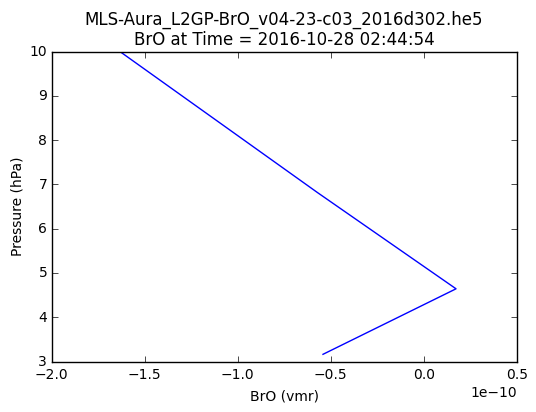

Copyright (C) 2016 The HDF Group  
All rights reserved

This example code illustrates how to access and visualize a GES DISC MLS 
v4 [1] Swath HDF-EOS5 file in Python.

If you have any questions, suggestions, or comments on this example, please use
the HDF-EOS Forum (http://hdfeos.org/forums).  If you would like to see an
example of any other NASA HDF/HDF-EOS data product that is not listed in the
HDF-EOS Comprehensive Examples page (http://hdfeos.org/zoo), feel free to
contact us at eoshelp@hdfgroup.org or post it at the HDF-EOS Forum
(http://hdfeos.org/forums).

# Access MLS data from GES DISC via OPeNDAP

 The first step is to make sure that your NASA Earthdata Login username and password works with OPeNDAP server.


```python
import os
import datetime
import matplotlib as mpl
import matplotlib.pyplot as plt

from pydap.client import open_url, open_dods
from pydap.cas.urs import setup_session
from mpl_toolkits.basemap import Basemap
%matplotlib inline

# Replace username and passowrd to match yours.
session = setup_session('eoshelp', '******')

# Make sure you use https.
FILE_NAME = 'MLS-Aura_L2GP-BrO_v04-23-c03_2016d302.he5'
url = 'https://acdisc.gesdisc.eosdis.nasa.gov/opendap/HDF-EOS5/Aura_MLS_Level2/ML2BRO.004/2016/'+FILE_NAME
dataset = open_url(url, session=session)

# This should print all datasets available from the OPeNDAP url.
print dataset

```

    <DatasetType with children 'BrO_AscDescMode', 'BrO_Convergence', 'BrO_L2gpPrecision', 'BrO_L2gpValue', 'BrO_Quality', 'BrO_Status', 'BrO_ChunkNumber', 'BrO_LineOfSightAngle', 'BrO_LocalSolarTime', 'BrO_Longitude', 'BrO_OrbitGeodeticAngle', 'BrO_SolarZenithAngle', 'BrO_Time', 'BrO_APriori_AscDescMode', 'BrO_APriori_Convergence', 'BrO_APriori_L2gpPrecision', 'BrO_APriori_L2gpValue', 'BrO_APriori_Quality', 'BrO_APriori_Status', 'BrO_APriori_ChunkNumber', 'BrO_APriori_LineOfSightAngle', 'BrO_APriori_LocalSolarTime', 'BrO_APriori_Longitude', 'BrO_APriori_OrbitGeodeticAngle', 'BrO_APriori_SolarZenithAngle', 'BrO_APriori_Time', 'StructMetadata_0', 'coremetadata_0', 'xmlmetadata', 'BrO_Latitude', 'BrO_Pressure', 'BrO_APriori_Latitude', 'BrO_APriori_Pressure'>


Second, let's make sure that all data and attributes are read correctly.

The dataset BrO_L2gpValue is 2-D array with nTimes x nLevels dimensions. The first dimension (nTimes) is time dimension and the second dimension (nLevels) is pressure level. We pick an arbitrary index 399 (400th in time step) to plot line graph of BrO value (x) over pressure level (y). You can change 399 to a different number to generate plot at different time. 


```python
data = dataset['BrO_L2gpValue'][399,:].squeeze()
print data
print dataset['BrO_L2gpValue'].attributes
title = dataset['BrO_L2gpValue'].attributes['title']
units = dataset['BrO_L2gpValue'].attributes['units']

pressure =  dataset['BrO_Pressure'][:]
print pressure
pres_units = dataset['BrO_Pressure'].attributes['units']
time = dataset['BrO_Time'][:]
```

    [  0.00000000e+00   0.00000000e+00   0.00000000e+00   0.00000000e+00
       0.00000000e+00  -3.74916515e-10  -3.14158005e-10  -1.73345394e-10
       1.55571153e-10   1.19209809e-10  -1.27896735e-10  -2.47035892e-10
      -1.63307562e-10  -5.70108925e-11   1.74226189e-11  -5.41054632e-11
      -1.19155824e-10  -7.88699522e-11  -1.10642502e-11   4.69474598e-11
       8.74631964e-11   9.33837938e-11   1.35088815e-10   1.95402472e-10
       2.10984286e-10   1.91220997e-10   1.41762629e-10   8.85877482e-11
       4.28642087e-11   6.42613740e-12  -2.50976497e-11   0.00000000e+00
       0.00000000e+00   0.00000000e+00   0.00000000e+00   0.00000000e+00
       0.00000000e+00]
    {u'_FillValue': -999.9899902, u'fullnamepath': '/HDFEOS/SWATHS/BrO/Data Fields/L2gpValue', u'UniqueFieldDefinition': 'MLS-Specific', u'origname': 'L2gpValue', u'title': 'BrO', u'orig_dimname_list': 'nTimes nLevels', u'units': 'vmr', u'missing_value': -999.9899902}
    [  1.00000000e+03   6.81292053e+02   4.64158875e+02   3.16227753e+02
       2.15443466e+02   1.46779922e+02   1.00000000e+02   6.81292038e+01
       4.64158897e+01   3.16227760e+01   2.15443478e+01   1.46779928e+01
       1.00000000e+01   6.81292057e+00   4.64158869e+00   3.16227770e+00
       2.15443468e+00   1.46779931e+00   1.00000000e+00   6.81292057e-01
       4.64158893e-01   3.16227764e-01   2.15443462e-01   1.46779925e-01
       1.00000001e-01   4.64158878e-02   2.15443466e-02   9.99999978e-03
       4.64158878e-03   2.15443480e-03   1.00000005e-03   4.64158889e-04
       2.15443462e-04   9.99999975e-05   4.64158875e-05   2.15443470e-05
       9.99999975e-06]


Finally, let's plot data in line graph. Read MLS Data Quality Document [2] for useful range in BrO data, which is 3.2hPa - 10hPa. We will subset data for that range.


```python
plt.plot(data[12:16], pressure[12:16])
plt.ylabel('Pressure ({0})'.format(pres_units))
plt.xlabel('{0} ({1})'.format(title, units))
    
basename = os.path.basename(FILE_NAME)
timebase = datetime.datetime(1993, 1, 1, 0, 0, 0) + datetime.timedelta(seconds=time[399])
timedatum = timebase.strftime('%Y-%m-%d %H:%M:%S')
plt.title('{0}\n{1} at Time = {2}'.format(basename, title, timedatum))
fig = plt.gcf()

```





You can save the above plot in PNG file.


```python
pngfile = "{0}.py.png".format(basename)
fig.savefig(pngfile)
```

# References

1. https://cmr.earthdata.nasa.gov/search/concepts/C1251101115-GES_DISC/3
2. http://mls.jpl.nasa.gov/data/v4-2_data_quality_document.pdf

 
